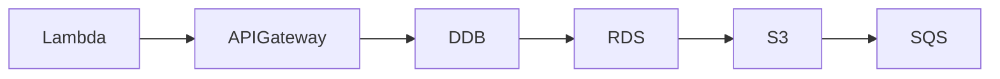

# InfraTales | AWS CDK Kinesis to OpenSearch Pipeline: Wiring Serverless Event Ingestion Without Losing Data

**AWS CDK (TYPESCRIPT) reference architecture — serverless pillar | advanced level**

> You need to ingest high-velocity event data, enrich it in flight, store it durably, and make it queryable — all without running a single always-on server. Stitching together Kinesis Streams, Firehose, Lambda, OpenSearch, Glue, and Athena in one coherent CDK stack is where most teams either over-engineer the wiring or miss critical IAM boundaries between services. The pain is real: a missed Kinesis shard iterator expiry or a Firehose buffer flush misconfiguration silently drops data at scale, and you only find out during a business review.

[](LICENSE)
[](CONTRIBUTING.md)
[](https://aws.amazon.com/)
[-IaC-purple.svg)](https://aws.amazon.com/cdk/)
[](https://infratales.com/p/edcdf31c-084c-44d5-953c-3bb4f86a15b9/)
[](https://infratales.com)


## 📋 Table of Contents

- [Overview](#-overview)
- [Architecture](#-architecture)
- [Key Design Decisions](#-key-design-decisions)
- [Getting Started](#-getting-started)
- [Deployment](#-deployment)
- [Docs](#-docs)
- [Full Guide](#-full-guide-on-infratales)
- [License](#-license)

---

## 🎯 Overview

The stack wires a serverless data pipeline end-to-end in CDK TypeScript [from-code]: API Gateway receives events, Lambda validates and forwards them to Kinesis Data Streams [from-code], Firehose buffers and lands raw payloads into S3 [from-code], and Kinesis Analytics runs SQL transformations in flight before fanning out to OpenSearch for near-real-time search and DynamoDB for low-latency key lookups [from-code]. Glue crawlers catalogue the S3 raw zone so Athena can run ad-hoc queries without a warehouse [from-code]. SNS and SQS handle dead-letter routing and async fan-out [from-code], CloudWatch alarms cover iterator age and Lambda error rates [from-code], and KMS encrypts data at rest across S3, DynamoDB, and the Kinesis streams [from-code]. The non-obvious design choice is the dual-sink pattern — the same enriched stream feeds both OpenSearch and DynamoDB, trading write amplification for query flexibility without a secondary ETL job [editorial].

**Pillar:** SERVERLESS — part of the [InfraTales AWS Reference Architecture series](https://infratales.com).
**Target audience:** advanced cloud and DevOps engineers building production AWS infrastructure.

---

## 🏗️ Architecture



> 📐 See [`diagrams/`](diagrams/) for full architecture, sequence, and data flow diagrams.

> Architecture diagrams in [`diagrams/`](diagrams/) show the full service topology (architecture, sequence, and data flow).
> The [`docs/architecture.md`](docs/architecture.md) file covers component responsibilities and data flow.

---

## 🔑 Key Design Decisions

- Kinesis Data Streams with provisioned shards costs ~$10.95/shard/month at rest — at low throughput, SQS + Lambda would be 80-90% cheaper, but Kinesis preserves ordering and replay within 7 days which SQS standard cannot guarantee [inferred]
- OpenSearch Service (managed) adds a minimum ~$50-150/month for even a single-node dev domain; at small event volumes, DynamoDB + Athena alone would cover most query patterns without the operational overhead of index management [inferred]
- Firehose buffering (default 5 min / 128 MB) means data lands in S3 with a lag — acceptable for analytics but disqualifying for anything needing sub-minute alerting, which is why OpenSearch gets the hot path via Kinesis Analytics [inferred]
- Glue crawler re-runs are needed every time the S3 partition scheme changes — if Lambda output schema drifts without a corresponding crawler trigger, Athena queries silently return stale or incomplete results [inferred]
- KMS encryption on every service (S3, DynamoDB, Kinesis, Firehose) adds per-API-call costs that are negligible at low scale but can add $20-60/month at millions of events/day; envelope encryption with a single CMK across services is the right call here [editorial]

> For the full reasoning behind each decision — cost models, alternatives considered, and what breaks at scale — see the **[Full Guide on InfraTales](https://infratales.com/p/edcdf31c-084c-44d5-953c-3bb4f86a15b9/)**.

---

## 🚀 Getting Started

### Prerequisites

```bash
node >= 18
npm >= 9
aws-cdk >= 2.x
AWS CLI configured with appropriate permissions
```

### Install

```bash
git clone https://github.com/InfraTales/<repo-name>.git
cd <repo-name>
npm install
```

### Bootstrap (first time per account/region)

```bash
cdk bootstrap aws://YOUR_ACCOUNT_ID/YOUR_REGION
```

---

## 📦 Deployment

```bash
# Review what will be created
cdk diff --context env=dev

# Deploy to dev
cdk deploy --context env=dev

# Deploy to production (requires broadening approval)
cdk deploy --context env=prod --require-approval broadening
```

> ⚠️ Always run `cdk diff` before deploying to production. Review all IAM and security group changes.

---

## 📂 Docs

| Document | Description |
|---|---|
| [Architecture](docs/architecture.md) | System design, component responsibilities, data flow |
| [Runbook](docs/runbook.md) | Operational runbook for on-call engineers |
| [Cost Model](docs/cost.md) | Cost breakdown by component and environment (₹) |
| [Security](docs/security.md) | Security controls, IAM boundaries, compliance notes |
| [Troubleshooting](docs/troubleshooting.md) | Common issues and fixes |

---

## 📖 Full Guide on InfraTales

This repo contains **sanitized reference code**. The full production guide covers:

- Complete AWS CDK (TYPESCRIPT) stack walkthrough with annotated code
- Step-by-step deployment sequence with validation checkpoints
- Edge cases and failure modes — what breaks in production and why
- Cost breakdown by component and environment
- Alternatives considered and the exact reasons they were ruled out
- Post-deploy validation checklist

**→ [Read the Full Production Guide on InfraTales](https://infratales.com/p/edcdf31c-084c-44d5-953c-3bb4f86a15b9/)**

---

## 🤝 Contributing

See [CONTRIBUTING.md](CONTRIBUTING.md) for guidelines. Issues and PRs welcome.

## 🔒 Security

See [SECURITY.md](SECURITY.md) for our security policy and how to report vulnerabilities responsibly.

## 📄 License

See [LICENSE](LICENSE) for terms. Source code is provided for reference and learning.

---

<p align="center">
  Built by <a href="https://www.rahulladumor.com">Rahul Ladumor</a> | <a href="https://infratales.com">InfraTales</a> — Production AWS Architecture for Engineers Who Build Real Systems
</p>
